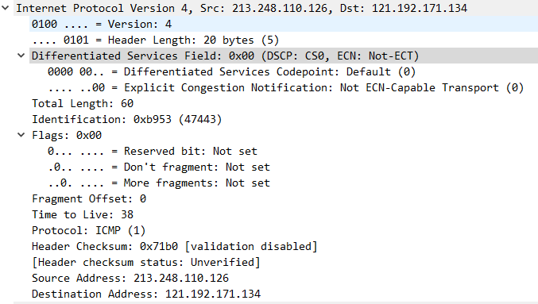
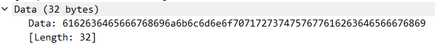
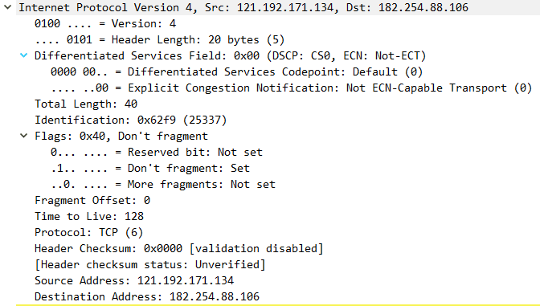
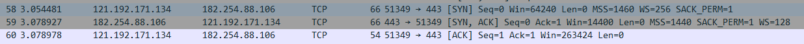
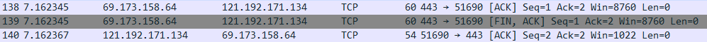
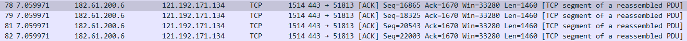
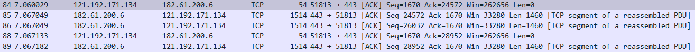
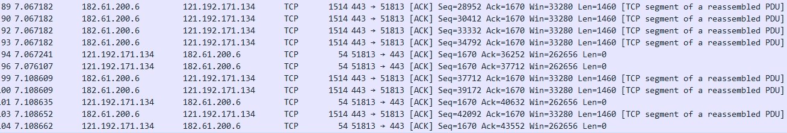

# 实验三、基于 PCAP 库侦听并分析网络流量

### 	1、 实验目的

​		通过完成实验，理解数据链路层、网络层、传输层和应用层的基本原理。掌 握用 Wireshark 观察网络流量并辅助网络侦听相关的编程；掌握用 Libpcap 或 WinPcap 库侦听并处理以太网帧和 IP 报文的方法；熟悉以太网帧、IP 报文、TCP 段和 FTP 命令的格式概念，掌握 TCP 协议的基本机制；熟悉帧头部或 IP 报文头 部各字段的含义。熟悉 TCP 段和 FTP 数据协议的概念，熟悉段头部各字段和 FTP 控制命令的指令和数据的含义。

### 	2、用户需求

##### 		1、用侦听解析软件观察数据格式

​			用 Wireshark 或 Omnipeek 等网络侦听软件网络上的数据流，验证理论课讲 授的网络协议层次嵌套，验证帧格式、IP 报文格式、TCP 段格式和 FTP 协议命 令和响应的格式，验证 MAC 地址、IP 地址、TCP 端口等协议地址格式。 

##### 		2、用侦听解析软件观察 TCP 机制

​			用 Wireshark 侦听并观察 TCP 数据段。观察其建立和撤除连接的过程，观察 段 ID、窗口机制和拥塞控制机制等。将该过程截图在报告中。 

##### 		3、用 Libpcap 或 WinPcap 库侦听网络数据

​			用 Libpcap 或 WinPcap 库侦听网络上的数据流，解析发送方与接收方的 MAC 和 IP 地址，并作记录与统计。程序在文件上输出形如下列 CSV 格式的日志： 

​			时间、源 MAC、源 IP、目标 MAC、目标 IP、帧长度（以逗号间隔） $2015-03-14 13:05:16,60-36-DD-7D-D5-21,192.168.33.1,60-36- DD-7D-D5-72,192.168.33.2,1536$ 

​			每隔一段时间（如 1 分钟），程序统计来自不同 MAC 和 IP 地址的通信数 据长度，统计发至不同 MAC 和 IP 地址的通信数据长度。

##### 		4、解析侦听到的网络数据

​			用 Wireshark 侦听并观察 FTP 数据，分析其用户名密码所在报文的上下文特 征，再总结出提取用户名密码的有效方法。解析协议内容，并作记录与统计。对 用户登录行为进行记录。程序在文件上输出形如下列 CSV 格式的日志： 

​			时间、源 MAC、源 IP、目标 MAC、目标 IP、登录名、口令、成功与否 
$$
2015-03-14 13:05:16,60-36-DD-7D-D5-21,192.168.33.1,60-36- DD-7D-D5-72,192.168.33.2,student,software,SUCCEED
$$

$$
2015-03-14 13:05:16,60-36-DD-7D-D5-21,192.168.33.1,60-36- DD-7D-D5-72,192.168.33.2,student,software1,FAILED
$$

​			通过监听 FTP 通信时的网络分组，了解 FTP 的通信协议的过程。在此基础 上，重点掌握 FTP 登陆环节的通信过程。 通过实验 3 熟悉网络分组的格式，并对“数据区”进行分析。通过对分组中 “数据区”的分析，提取用户名、密码、登陆是否成功的反馈信息。一般登录名 以“USER”开头，口令以“PASS”开头，登录成功以“230”开头，失败以“530” 开头。 如有条件，可以在虚拟机上访问数据，在主机侦听，用以模拟交换机上的“镜 像端口”或者在局域网内侦听的过程。注意：由于多数网络交换机分割了广播域， 因此你在局域网内侦听到的包可能有限。

### 	3、实验内容

##### 		1、用侦听解析软件观察数据格式

​			以下为观察到的IP报文头部

​				以下为上述IP报文的载荷

​				以下为观察到的TCP报文头部

​				以下为上述TCP报文内包裹的IP报文

​			

***To be Done...***

​			

##### 		2、用侦听解析软件观察 TCP 机制

​			以下为连接的建立（三次握手）

​			以下为链接的解除（四次挥手）

​			以下为观察到的TCP段ID

​			以下为观察到的TCP的窗口机制

​			以下为观察到的TCP的拥塞处理

